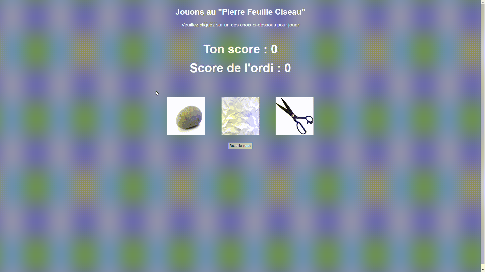

# SHIFUMI 👊✋✌️

On va créer le jeu du shifumi ou "Pierre - feuille - ciseau"

## Code fourni
- `index.html` le fichier HTML contenant le jeu qui inclut (pas besoin d'y toucher normalement) : 
  - `css/style.css` le fichier des styles que vous pouvez changer si vous le souhaitez (déjà lié)
  - `js/app.js` le fichier qui devra contenir le code javascript (déjà lié)

## Challenge
### Etape 1 : Le choix de l'utilisateur
- On veut connaitre le bouton sur lequel l'utilisateur a cliqué. 
  - Récupérer le clic de l'utilisateur 
  - Puis l'afficher dans la console

Spoiler

1. Il faudra utiliser un écouteur d'événements 
2. Il faudra utiliser un console.log pour l'affichage dans la console

### Etape 2 : Le choix de l'ordinateur
- On veut que l'ordinateur fasse un choix parmi les trois propositions : pierre, feuille ou ciseau.
  - Créer une fonction qui permet de faire ce choix
  - Il faut que ce choix soit aléatoire
  - On veut afficher ce choix dans la console
  - On veut retourner ce choix pour l'utiliser plus tard

Spoiler

1. Pour le choix, vous pouvez utiliser Math.random pour obtenir un nombre qui sera soit 1, 2 ou 3. 
2. La fonction n'a pas besoin de prendre de paramètres.

### Etape 3 : Le traitement du choix de l'ordinateur
- On souhaite pouvoir directement comprendre (en tant qu'humain) ce qu'a choisi l'ordinateur.
  - Créer une fonction qui permet de convertir le choix de l'ordinateur.
    - Si 1 => pierre
    - Si 2 => feuille
    - Si 3 => ciseau
  - On souhaite retourner cette valeur

Spoiler

1. Pour la conversion, vous pouvez poser une condition pour être dans le bon choix et ainsi affecter la bonne string au choix de l'ordinateur. 

### Etape 4 : Qui a gagné ?
- On souhaite savoir qui a gagné
  - Créer une fonction qui permet de comparer le choix de l'utilisateur avec celui de l'ordinateur
  - On voudra pour le moment afficher le gagnant du duel dans la console
  - Bonus : S'il y a égalité, on voudra afficher "Egalité" dynamiquement dans le HTML dans la `div #gagnant`. Ce message devra s'effacer au prochain clic s'il n'y a pas de nouvelle égalité.

Spoiler

1. Pour la comparaison, vous pouvez poser une condition pour être dans le bon choix. 
2. La fonction prendra deux paramètres 
3. Le clic de l'utilisateur a été appelé grâce à un ecouteur d'évenements 

  

Second Spoiler

  1. Il faudra appeler cette fonction lors du clic de l'utilisateur sur un des choix. 
  2. Le paramètre "event" sera alors donné à cette fonction 
  3. On pourra donc comparer `event.target.id` et le choix de l'ordinateur
  

  

### Etape 5 : Les scores
- On souhaite connaitre les scores des deux joueurs.
  - créer une/des fonction(s) qui permettent en fonction du résultat de la fonction de l'étape 4 d'augmenter soit le score du joueur soit celui de l'ordinateur
  - On veut afficher les scores en console pour le moment.

Spoiler

1. Pour le stockage des scores, vous pouvez créer des propriétés (si vous êtes en POO) pour stocker les scores. 

### Etape 6 : Quels sont les scores ?
- On souhaite connaitre les scores des deux joueurs directement sans avoir à regarder dans la console
  - Afficher le score du joueur dans la span d'id __'score'__
  - Afficher le score de l'ordinateur dans la span d'id __'scoreOrdi'__

Spoiler

1. Vous pouvez créer des fonctions (une pour le joueur et une pour l'ordi) qui incrémentent le score en fonction du resultat des choix 
2. Dans cette fonction, vous pourrez incrémenter le score et l'afficher.

### Etape 7 : Qui a choisi quoi ?
- On souhaite maintenant savoir ce qu'a choisi le joueur et ce qu'a choisi l'ordinateur
  - créer une fonction qui permet d'afficher une phrase qui montre les choix des joueurs
  - Il faudra afficher cette phrase dans la div d'id __'affichageChoix'__
  - La phrase pourra ressembler à "L'ordinateur a choisi pierre et vous avez choisi feuille !"

Spoiler

1. Cette fonction pourra prendre deux paramètres : 
  - le choix du joueur 
  - le choix de l'ordinateur

### Etape Bonus : Une nouvelle partie ?
- On souhaite recommencer une nouvelle partie sans avoir à rafraichir la page
  - Créer une fonction qui permet de recommencer une nouvelle partie
  - Elle devra lorsque l'on clique sur le bouton d'id __'reset'__ :
    - Ne pas rafraichir la page
    - Remettre les scores à 0
    - Effacer la phrase qui montre les choix des joueurs
    - Effacer la phrase du bonus de l'étape 4.

Spoiler

1. Cette fonction devra être lancée que lors d'un évenement 
2. Il faudra utiliser la paramètre 'event' 
3. Il faudra rendre vide les strings qui contiennent quelque chose ou pas.

## Correction
- Vous pourrez trouver ma correction -> https://github.com/Remplt/shifumi dans le dossier js.
- Dans le dossier js, vous trouverez un fichier app.js qui contient le code sous forme fonctionnelle et dans le fichier app-object.js, vous trouverez le code sous POO.
- Le fichier app.js ne contient ni la fonction de reset ni le bonus de l'étape 4 ni la fonction qui affiche les choix. Vous pourrez trouver ces fonctions dans le fichier app-object.js

## Feedback
- Les retours sur les explications sont les bienvenus
- Les retours sur mon code sont les bienvenus
- Les retours sur le design ne sont pas les bienvenus 😂

## Auteur(s)
<ul>
  <li> Rémy Plt - <i> Travail Initial / Base du site </i> - <a href="https://github.com/Remplt"> Remplt </a>
</ul>
